# 抽選プラグイン＆Mod 操作マニュアル

抽選プラグイン＆Mod（以下，本システム）は，メンバーシップ会員のみなさんに，**公正に企画（イベント）に参加**してもらうための抽選システムです。
このマニュアルでは，このシステムをしっかりと理解して，安全に利用するための手順を説明しています。

## 1. システムの概要

本システムは，Hub サーバに入っている「**抽選エントリーシステム**」と，企画をするサーバに入っている「**守衛システム**」を組み合わせて動きます。

### 1.1. 抽選エントリーシステム

これは，新しく企画を立てるときに，メンバーシップ会員の皆さんから参加希望者を募るためのシステムです。

参加希望者は，Hub サーバに入っているこのシステムに対してコマンドを送ることで，**企画への参加を申し込めます**。

**私たちがすること**は，このシステムに企画を登録して，参加希望者の受付を開始することです。
そして，受付期間が終了したら参加希望者の中から抽選をして，当選した人にだけ企画への参加権を与えます。

### 1.2. 守衛システム

これは，企画をやっているときに，参加者以外の人が企画のお部屋に入れないようにするためのシステムです。

守衛システムは，企画のお部屋に入ろうとする人の**企画参加権を確認**します。
ここで重要なことは，企画参加権を持っていないひとでも，サーバの人数に余裕があれば，**サーバに入ること自体はできる**という点です。

**私たちがすること**は，企画が始まったときには守衛システムを有効にして，企画が終わったときにはこれを無効にすることです。

## 2. 抽選エントリーシステムの使い方

メンバーシップ会員の皆さんが企画に参加するためには，まず Hub サーバに入って，抽選エントリーシステムに参加希望の申し込みをする必要があります。

私たちは，企画を立てるときに，抽選エントリーシステムに企画を登録して，参加希望者の受付を開始しなければいけません。

### 2.1. 企画を登録する

これは，**企画を立てるときに一度だけ行う操作**です。

企画には，100 文字以内の**企画名**をつける必要があります。
企画名は，参加希望者が企画を識別するために使うので，わかりやすい名前をつけてください。
例えば，「かくれんぼ大会」や「夏祭り2025」などが良い例です（スペースは使えません）。

企画を登録するには，Hub サーバに入って，以下のコマンドを実行してください。
このコマンドを実行するためには，管理者権限（OP 権限）が必要です。

```
/lottery new <企画名>
```

例えば，「かくれんぼ大会」という企画を登録する場合は，以下のようにコマンドを実行してください。  


このコマンドを実行すると，新しく企画が登録されて，その企画を識別するための**企画ID**が表示されます。
企画IDは，後に企画を管理するために必要になるので，必ずメモしておいてください。  
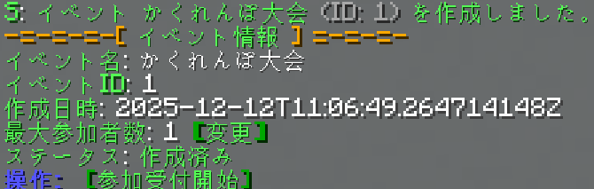

### 2.2. 企画に参加できる人数を設定する

正しく抽選を行うためには，その**企画に参加できる人数**を設定する必要があります。
例えば，「サッカー」は 22 人まで参加できる企画ですが，「かくれんぼ大会」は 10 人までしか参加できない企画かもしれません。

企画に参加できる人数を設定するには，企画を登録したときに表示された `最大参加者数: X [変更]` の `[変更]` ボタンをクリックしてください。
そうすると，以下のようなコマンドがチャットに入力されます。  


この画面で，他のキーを何も押さずに，参加できる人数を入力して，Enter キーを押してください。
なお，参加できる人数は 1 以上の整数でなければいけません。

例えば，「かくれんぼ大会」は 10 人まで参加できる企画である場合は，以下のように入力して Enter キーを押してください。  


これを実行すると，企画に参加できる人数が設定され，次のようなメッセージが表示されます。  
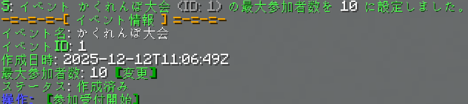

> [!TIP]
> なお，この操作は `/lottery config <企画 ID または企画名> max_participants <人数>` コマンドを直接実行することでも行えます。

>[!IMPORTANT]
> 企画名を使って指定するか，企画IDを使って指定するかに迷ったら，企画IDを使うことをお勧めします。
> 企画名で指定したとき，もし同じ名前の企画が複数存在した場合は，エラーになってしまうからです。
> 企画IDは必ず一つの企画にだけ対応しているので，より安全に指定できます。

### 2.3. 参加希望者の受付を開始する

企画を登録して，参加できる人数を設定したら，次に**参加希望者の受付を開始**します。
参加希望者の受付を開始するには，企画を登録したときに表示された `[参加受付開始]` ボタンを押してください。

そうすると，以下のようなメッセージが表示されて，参加希望者の受付が開始されます。

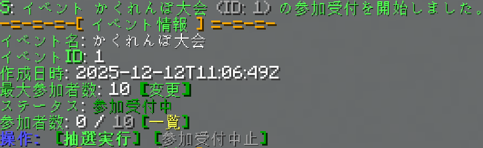

> [!TIP]
> なお，この操作は `/lottery open <企画 ID または企画名>` コマンドを直接実行することでも行えます。
> この場合は `/lottery open 1` であるとか， `/lottery open かくれんぼ大会` となります。

> [!NOTE]
> 受け付けを開始すると，Hub 鯖に居るすべてのメンバーシップ会員の方に向けて，以下ののような告知メッセージが送信されます。  
> 
> 
> さらに，新たに Hub 鯖に入ってきたメンバーシップ会員の方にも，以下のような告知メッセージが送信されます。  
> 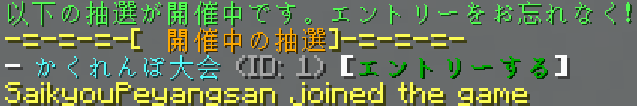

#### 2.3.1. ケース：参加者の参加を待つ

参加希望者の受付を開始した後は，参加希望者が集まるまで待ちます。
これは私たちには関係ありませんが，メンバーシップ会員の皆さんは，次のいずれか手段で参加希望の申し込みを行います。

- `/entry <企画 ID または企画名>` コマンドを実行する
- `/entry` コマンドを単に実行する  
  エントリー可能な企画が一つだけの場合に限り，このコマンドで参加希望の申し込みが行えます。
  複数の企画がエントリー可能な場合は，以下のようなメッセージが表示され，その中から参加したい企画を選んでもらいます。
    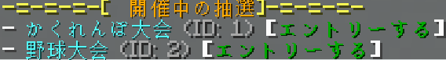
- 受け付けが開始されたときに送信された告知メッセージの中にある，`[参加する]` ボタンをクリックする
  
このようにして，メンバーシップ会員の皆さんが参加希望の申し込みを行うと，以下のようなメッセージが表示されます。  


なお，参加希望の申込みを取り消したい場合には，以下のコマンドを実行するか，告知メッセージの中にある `[キャンセルする]` ボタンをクリックしてもらいます。

```
/entry [企画 ID または企画名] cancel
```

これを実行すると，以下のようなメッセージが表示されます。


>[!IMPORTANT]
> 企画名を使って指定するか，企画IDを使って指定するかに迷ったら，企画IDを使うことをお勧めします。
> 企画名で指定したとき，もし同じ名前の企画が複数存在した場合は，エラーになってしまうからです。
> 企画IDは必ず一つの企画にだけ対応しているので，より安全に指定できます。

#### 2.3.2. ケース：参加者の集まり具合や，企画の状態を確認する

参加希望者の受付を開始した後には，参加者の集まり具合を確認したいことがあります。
その場合には，以下のコマンドを実行してください。
なお，このコマンドを実行するためには，管理者権限（OP 権限）が必要です。

```
/lottery status <企画 ID または企画名>
```

このコマンドは，いつでも実行可能で，企画の現在の情報を表示します。

例えば，「かくれんぼ大会」の参加希望者の集まり具合を確認する場合は，以下のようにコマンドを実行してください。

```
/lottery status かくれんぼ大会
...または
/lottery status 1
```

>[!IMPORTANT]
> 企画名を使って指定するか，企画IDを使って指定するかに迷ったら，企画IDを使うことをお勧めします。
> 企画名で指定したとき，もし同じ名前の企画が複数存在した場合は，エラーになってしまうからです。
> 企画IDは必ず一つの企画にだけ対応しているので，より安全に指定できます。

これを実行すると，以下のようなメッセージが表示されます。  
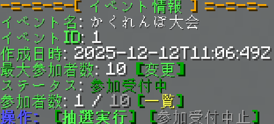

このメッセージには，企画の現在の状態が表示されます。
例えば，企画名，企画ID，参加できる人数，現在の参加希望者数，参加希望者の一覧などが表示されます。
また，企画が進行中の場合には，参加率などの便利な情報も表示されます。

この画面で `参加者数: X/X [一覧]` の `[一覧]` ボタンをクリックすると，参加希望者の一覧が表示されます。  


さらに，表示されたメンバーシップ会員の方の名前をクリックすると，その会員の過去の参加履歴（当選や落選の履歴）が表示されます。  
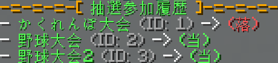

#### 2.3.3. ケース：受け付けをいったん取りやめる

参加希望者の受付を開始した後に，何らかの理由でいったん受付を取りやめたい場合があります。
例えば，設定に不備があったであるとか，企画自体を中止したい場合などです。

その場合には，[ケース：ケース：参加者の集まり具合や，企画の状態を確認する](#232-ケース参加者の集まり具合や企画の状態を確認する)で説明したように，企画の状態を確認するコマンドを実行してください。

企画の状態を確認するコマンドは `/lottery status <企画 ID または企画名>` です。
これを実行すると，以下のようなメッセージが表示されますから，`[参加受付中止]` ボタンをクリックしてください。


これを実行すると，以下のようなメッセージが表示されて，参加希望者の受付が取りやめられます。

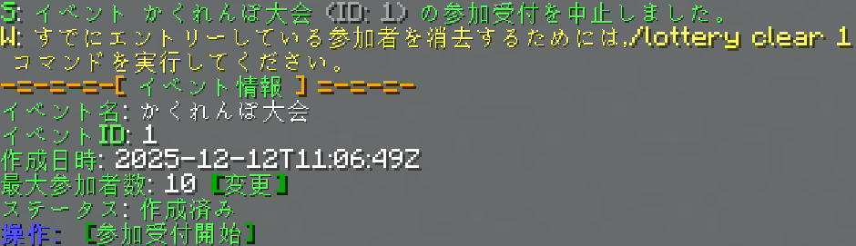

なお，この操作は `/lottery close <企画 ID または企画名>` コマンドを直接実行することでも行えます。
これには管理者権限（OP 権限）が必要です。

> [!TIP]
> なお，参加希望者の受付を取りやめても，すでに参加を申し込んでいるメンバーシップ会員の方の情報は残ります。
> そのため，参加者を消去して まっさら の状態にしたい場合には，`/lottery clear <企画 ID または企画名>` コマンドを実行してください。

#### 2.3.4. 統合版（BE）プレイヤが参加できないようにする

執り行う企画の種類によっては，Minecraft 統合版では快適に遊べなかったり，全く遊べない場合があります。
本システムは，そういったことが事前に分かっている場合に，統合版クライアントの抽選参加やログインを制限する機能があります。

その場合には，[ケース：ケース：参加者の集まり具合や，企画の状態を確認する](#232-ケース参加者の集まり具合や企画の状態を確認する)で説明したように，企画の状態を確認するコマンドを実行してください。

企画の状態を確認するコマンドは `/lottery status <企画 ID または企画名>` です。
これを実行すると，以下のようなメッセージが表示されますから，`統合版プレイヤの参加: 可 [変更]` ボタンをクリックしてください。


この画面で，他のキーを何も押さずに，`true` または `false` と入力して Enter を押してください。
`true` は統合版プレイヤの参加が可能であること，`false` は参加ができないことを指し示します。

例えば，統合版の参加ができない企画では以下のように入力してください：
```
/lottery config <企画 ID または企画名> allow_bedrock false
```

これを行うと，設定が完了します。

### 2.3.5. ケース：ダイヤモンド・プラン会員を優先的に当選させる

参加希望者の受付を開始した後に，ダイヤモンド・プラン会員の方を優先的に当選させたい場合があります。

その場合には，[ケース：ケース：参加者の集まり具合や，企画の状態を確認する](#232-ケース参加者の集まり具合や企画の状態を確認する)で説明したように，企画の状態を確認するコマンドを実行してください。
企画の状態を確認するコマンドは `/lottery status <企画 ID または企画名>` です。

これを実行すると，以下のようなメッセージが表示されますから，`ダイヤ優先枠数： X [変更]` ボタンをクリックしてください。  
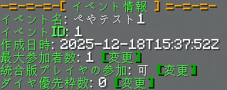

この画面で，他のキーを何も押さずに，優先枠数を入力して，Enter キーを押してください。
例えば，ダイヤモンド・プラン会員の方を 3 人まで優先的に当選させたい場合は，以下のように入力して Enter キーを押してください。  


これを実行すると，優先枠数が設定され，次のようなメッセージが表示されます。  
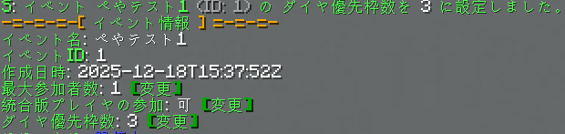

> [!TIP]
> なお，この操作は `/lottery config <企画 ID または企画名> vip_slots <優先枠数>` コマンドを直接実行することでも行えます。
> この場合は `/lottery config 1 vip_slots 3` であるとか， `/lottery config かくれんぼ大会 vip_slots 3` となります。

### 2.4. 抽選を実行する

参加希望者の受付を終了したら，次に**抽選を実行**します。
抽選を実行するには，企画の状態を確認するコマンド（`/lottery status <企画 ID または企画名>`）を実行して，
表示されたメッセージの中にある `[抽選実行]` ボタンをクリックしてください。


これを実行すると，以下のようなメッセージが表示されて，抽選が実行されます。

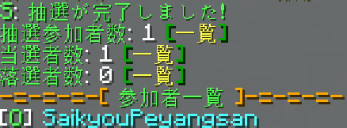

> [!TIP]
> なお，この操作は `/lottery draw <企画 ID または企画名>` コマンドを直接実行することでも行えます。
> これを実行するためには，管理者権限（OP 権限）が必要です。

#### 2.4.1. ケース当選者や落選者だけを確認する

抽選を実行した後に，当選者だけを確認したい場合があります。
その場合には，抽選終了時に表示されたメッセージの中にある `当選者: X [一覧]` や `落選者: Y [一覧]` の `[一覧]` ボタンをクリックしてください。

これを行うと，以下のようなメッセージが表示されます。


なお，名前は以下の２種類の色で表示されます
- 白色：石や鉄プランのメンバーシップ会員の方
- 水色：ダイヤモンド・プランのメンバーシップ会員の方

> [!TIP]
> 表示されたメンバーシップ会員の方の名前をクリックすると，その会員の過去の参加履歴（当選や落選の履歴）が表示されます。

#### 2.4.2. ケース：再抽選をする

抽選を実行した後に，何らかの理由で再度抽選を行いたい場合があります。

その場合には，企画の状態を確認するコマンド（`/lottery status <企画 ID または企画名>`）を実行して，
表示されたメッセージの中にある `[再抽選]` ボタンをクリックしてください。  
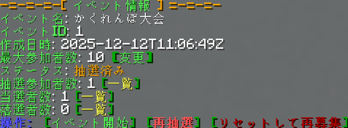

これを実行すると，最初から抽選がやり直されます。

#### 2.4.3. ケース：抽選をとりやめて，受け付けを再開する

抽選を実行した後に，何らかの理由で抽選をとりやめて，参加希望者の受付を再開したい場合があります。

その場合には，企画の状態を確認するコマンド（`/lottery status <企画 ID または企画名>`）を実行して，
表示されたメッセージの中にある `[リセットして再募集]` ボタンをクリックしてください。 


これを実行すると，抽選結果がすべて取り消されて，参加希望者の受付が再開されます。

> [!TIP]
> なお，この操作は `/lottery reset <企画 ID または企画名>` コマンドを直接実行することでも行えます。
> これを実行するためには，管理者権限（OP 権限）が必要です。

> [!IMPORTANT]
> この操作を実行しても，エントリーしているメンバーシップ会員の方の情報は残ります。
> そのため，参加者を消去して まっさら の状態にしたい場合には，`/lottery clear <企画 ID または企画名>` コマンドを実行してください。
> これを実行するためには，管理者権限（OP 権限）が必要です。

### 2.6. 便利なコマンド一覧

さて，以上が抽選エントリーシステムの基本的な使い方です。
企画を立てるときには，このシステムを使って，メンバーシップ会員の皆さんから参加希望者を募り，公正に抽選を行ってください。

以下に，抽選エントリーシステムで使える便利なコマンドを一覧にまとめます。

| コマンド                                                   | 説明                 | 管理者権限 |
|--------------------------------------------------------|--------------------|-------|
| `/lottery new <企画名>`                                   | 新しい企画を登録する         | ◯     |
| `/lottery config <企画 ID または企画名> max_participants <人数>` | 企画に参加できる人数を設定する    | ◯     |
| `/lottery config <企画 ID または企画名> allow_bedrock <true/false>` | 企画に統合版で参加できるかどうかを設定する    | ◯     |
| `/lottery open <企画 ID または企画名>`                         | 参加希望者の受付を開始する      | ◯     |
| `/lottery close <企画 ID または企画名>`                        | 参加希望者の受付を取りやめる     | ◯     |
| `/lottery status <企画 ID または企画名>`                       | 企画の状態を確認する         | ◯     |
| `/lottery draw <企画 ID または企画名>`                         | 抽選を実行する            | ◯     |
| `/lottery reset <企画 ID または企画名>`                        | 抽選をとりやめて，受け付けを再開する | ◯     |
| `/lottery clear <企画 ID または企画名>`                        | 企画の参加者情報をすべて消去する   | ◯     |
| `/entry <企画 ID または企画名>`                                | 企画に参加希望の申し込みをする    | ✕     |
| `/entry [企画 ID または企画名] cancel`                         | 企画への参加希望の申し込みを取り消す | ✕     |

>[!IMPORTANT]
> 企画名を使って指定するか，企画IDを使って指定するかに迷ったら，企画IDを使うことをお勧めします。
> 企画名で指定したとき，もし同じ名前の企画が複数存在した場合は，エラーになってしまうからです。
> 企画IDは必ず一つの企画にだけ対応しているので，より安全に指定できます。

## 3. 守衛システムの使い方

企画を実行するときには，守衛システムを有効にして，参加者以外の人が企画のお部屋に入れないようにする必要があります。
さらに，企画が終わったときには，守衛システムを無効にして，通常の状態に戻す必要があります（忘れないように注意してください！）。

### 3.1. 企画を開始する

企画を開始するときには，企画のお部屋に入って，企画の状態を確認するコマンド（`/lottery status <企画 ID または企画名>`）を実行してください。
これを実行すると，以下のようなメッセージが表示されます。


このメッセージの中にある `[イベント開始]` ボタンをクリックすると，守衛システムが有効になって企画が開始されます。

> [!TIP]
> なお，この操作は `/lottery start <企画 ID または企画名>` コマンドを直接実行することでも行えます。
> これを実行するためには，管理者権限（OP 権限）が必要です。

企画が開始されると，以下のようなメッセージが表示されます。


#### 3.1.1. 守衛システムがすること

ただ守衛システムを有効にしただけでは，企画のお部屋に入ろうとする人の企画参加権は確認されません。
守衛システムが行うことは，**企画のお部屋の人数が満員のときに限って**，参加権を確認することです。

例えば，企画のお部屋の最大人数が 20 人で，現在の人数が 18 人である場合には，守衛システムは何も行いません。
この状態で，参加者以外の人が企画のお部屋に入ろうとした場合でも，普通に入れます。

一方で，企画のお部屋の最大人数が 20 人で，現在の人数が 20 人である場合には，守衛システムは企画参加権を確認します。 
この状態で，参加者以外の人が企画のお部屋に入ろうとした場合には，企画参加権がないために入れません。

#### 3.1.2. ケース：当選者以外をサーバから強制退出する

とはいえ，企画を開始した直後には，まだ企画のお部屋に参加者以外の人が入っている可能性があります。
例えば「かくれんぼ」のような人数が厳格ではない企画であれば，これは問題にならないかもしれません。
しかし，「サッカー」のように人数が厳格に決まっている企画であれば，参加者以外の人がサーバに居ると，企画が始められません。

その場合には，企画のお部屋に入って，企画の状態を確認するコマンド（`/lottery status <企画 ID または企画名>`）を実行してください。
これを実行すると，以下のようなメッセージが表示されます。

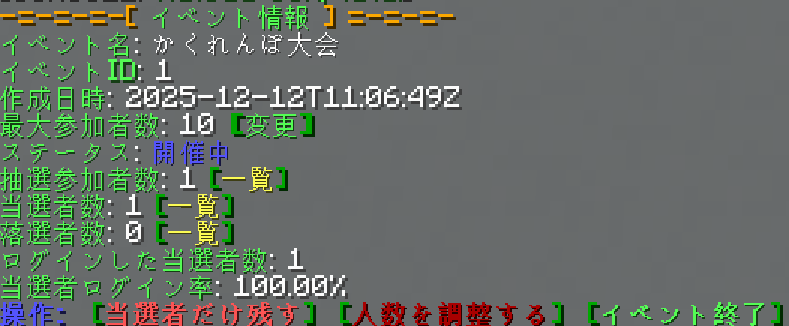

このメッセージの中にある `[当選者だけ残す]` ボタンをクリックすると，企画のお部屋に入っている当選者以外の人が強制的に退出させられます。
> [!TIP]
> なお，この操作は `/lottery shrink <企画 ID または企画名>` コマンドを直接実行することでも行えます。
> これを実行するためには，管理者権限（OP 権限）が必要です。

#### 3.1.3. ケース：企画の人数に合わせてサーバの最大人数を変更する

企画のお部屋は，余裕をもって人数を設定していることが多いです。
例えば，企画のお部屋の最大人数が 50 人である場合に，「かくれんぼ大会」の参加者が 10 人であるならば，40 人も余裕があります。
このような場合には，企画のお部屋の最大人数を，企画の参加者数に合わせて変更する機能が使えます。

企画のお部屋に入って，企画の状態を確認するコマンド（`/lottery status <企画 ID または企画名>`）を実行してください。
これを実行すると，以下のようなメッセージが表示されます。


このメッセージの中にある `[人数を調整]` ボタンをクリックすると，企画のお部屋の最大人数が，企画の参加者数に合わせて変更されます。
さらに，企画のお部屋に入っている人数が，変更後の最大人数を超えている場合には，超過分の人が強制的に退出されます。
この退出は，抽選ロジックに基づいて行われるため，抽選の当選者が優先的に残ります。

> [!TIP]
> なお，この操作は `/lottery fit <企画 ID または企画名>` コマンドを直接実行することでも行えます。
> これを実行するためには，管理者権限（OP 権限）が必要です。

#### 3.1.4. ケース：参加勢が人数制限を無視できるようにする

例え企画に参加できる人数が限られていても，参加勢方々を優先的に参加させたい場合があります。
この場合は，`/lottery whitelist` コマンドを実行してください。

`/lottery whitelistP` コマンドは，ホワイトリストに登録されている人を優先的に参加させるかどうか，を切り替えるコマンドです。
企画のお部屋のホワイトリストには参加勢のみなさんが登録されていますから，`/lottery whitelist` コマンドを実行すると，
参加勢の方々が優先的に参加できるようになります。

この機能を無効にしたい場合は，もう一度 `/lottery whitelist` と実行してください。
そうすると，この機能が無効化されて優先参加が解除されます。

### 3.2. 企画を終了する

企画を終了するときには，企画のお部屋に入って，企画の状態を確認するコマンド（`/lottery status <企画 ID または企画名>`）を実行してください。
これを実行すると，以下のようなメッセージが表示されます。  


このメッセージの中にある `[イベント終了]` ボタンをクリックすると，守衛システムが無効になって企画が終了されます。

> [!TIP]
> なお，この操作は `/lottery end <企画 ID または企画名>` コマンドを直接実行することでも行えます。
> これを実行するためには，管理者権限（OP 権限）が必要です。

> [!CAUTION]
> この操作を忘れると，企画のお部屋に入ろうとする人の企画参加権が常に確認される状態になってしまいます。
> そのため，**企画が終わったら，必ずこの操作を行って**，守衛システムを無効にしてください！

### 3.3. 便利なコマンド一覧

さて，以上が守衛システムの基本的な使い方です。
企画を実行するときには，このシステムを使って，参加者以外の人が企画のお部屋に入れないようにしてください。

以下に，守衛システムで使える便利なコマンドを一覧にまとめます。

| コマンド                             | 説明                      | 管理者権限 |
|----------------------------------|-------------------------|-------|
| `/lottery start <企画 ID または企画名>`  | 企画を開始する                 | ◯     |
| `/lottery end <企画 ID または企画名>`    | 企画を終了する                 | ◯     |
| `/lottery shrink <企画 ID または企画名>` | 当選者以外をサーバから強制退出する       | ◯     |
| `/lottery fit <企画 ID または企画名>`    | 企画の人数に合わせてサーバの最大人数を変更する | ◯     |

>[!IMPORTANT]
> 企画名を使って指定するか，企画IDを使って指定するかに迷ったら，企画IDを使うことをお勧めします。
> 企画名で指定したとき，もし同じ名前の企画が複数存在した場合は，エラーになってしまうからです。
> 企画IDは必ず一つの企画にだけ対応しているので，より安全に指定できます。

なお，抽選エントリーシステムで使えるコマンド一覧については，[便利なコマンド一覧](#26-便利なコマンド一覧)を参照してください。
これらのコマンドは，**守衛システムでも使えます**。
